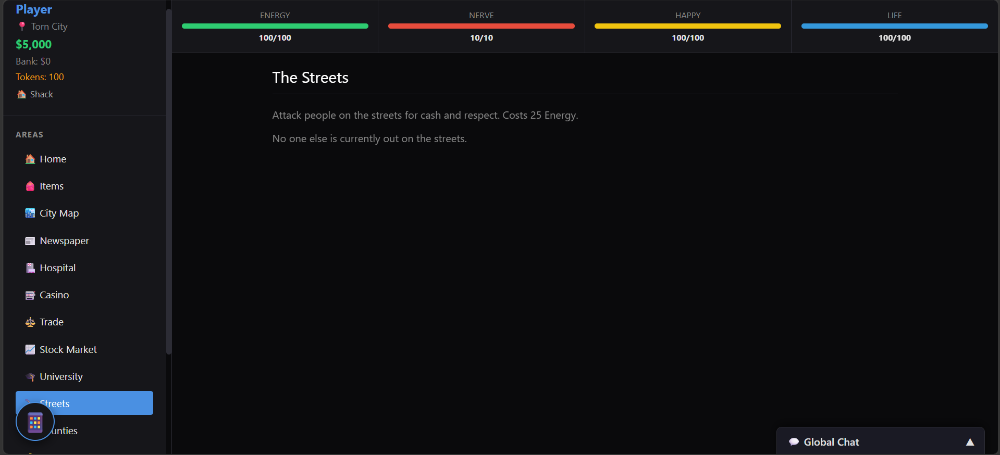

<href a="image.png"> </href>
# Neon Syndicate

Neon Syndicate is a real-time, multiplayer text-based browser game inspired by classic mafia and crime RPGs like Torn City. 

Build your stats in the gym, trade items on the global market, place assassination contracts on rival players, and risk your tokens in the server-validated casino. The game features a secure backend built with Node.js, Socket.io, and SQLite to ensure fair play, persistent progression, and live interaction between all players.



## Features

- **Real-Time Multiplayer:** See other players online, chat globally, and attack rivals live on the streets.
- **Player-Driven Economy:** Buy, sell, and trade items with other players on the Global Market.
- **Bounty System:** Place hit contracts on enemies for other players to claim.
- **Secure Casino:** Play Slots, Roulette, and Blackjack with server-side validation to prevent cheating.
- **Persistent Progression:** All cash, items, stats, and energy regenerate and save securely to an SQLite database.
- **Modern UI:** A clean, responsive dark-mode interface with real-time phone notifications.

## Quick Start

You can start the entire environment (both the game client and the backend server) automatically with a single command.

1. Run the setup script in your terminal:

```bash
bash setup.sh
```

This will automatically install any required dependencies, organize the files, and boot up the live server on `http://localhost:3000`.

## Tech Stack

- **Frontend:** HTML5, CSS3 (Vanilla), JavaScript
- **Backend:** Node.js, Express
- **Real-Time Communication:** Socket.io
- **Database:** SQLite3
- **Security:** bcrypt (password hashing)

## Contributing & Updates

This repository is built to be easily extensible. 
- You can add new items by updating the `ITEMS` array in `public/game.js`.
- You can add new server-side logic by adding Socket.io event listeners in `server.js`.
- The database schema will automatically initialize itself if `database.sqlite` is deleted or missing.
